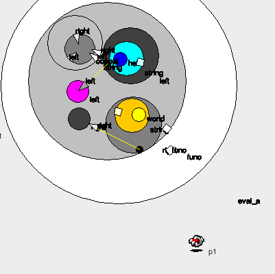

# Ambients Encoding Examples

Examples of computation abstractions using the [Robust Ambient](https://pdfs.semanticscholar.org/c847/a9bb262c87bffcae9b5e2dca5dcf88551ea2.pdf) calculus *(abbrv. ROAM)*.

The encodings in this repository are written in a text format used in [AmbIcobjs](https://www-sop.inria.fr/mimosa/ambicobjs/) tool. The syntax used in the examples makes the encodings easier to read and use in files and programs.

## Encodings

- [Monoids](https://github.com/ambientsprotocol/roam-examples/blob/master/monoids/README.md)
- [Functors](https://github.com/ambientsprotocol/roam-examples/blob/master/functors/README.md)

## Simulating Ambients

The example Ambients encodings in this repository can be run with the [AmbIcobjs](https://www-sop.inria.fr/mimosa/ambicobjs/) tool to simulate the ambient reductions and program behavior.



### Setup & Run

1. Download [ambicobj.jar](https://www-sop.inria.fr/mimosa/ambicobjs/ambicobj.jar) from the [AmbIcobjs](https://www-sop.inria.fr/mimosa/ambicobjs/) website
2. Go to the download directory and run the tool with `java -jar ambicobj.jar`
3. Once open, click the *"Robust Ambient"* icon (picture of a hand/glove)
4. Copy one of the encoding examples and paste it into the input box
5. Give the program some name (this can be whatever)
6. Drag the created "program" somewhere on the grey area (just to make it more visible)
7. Click the program icon
8. The simulation is now running and you should eventually see the fully reduced value of the program

### Example

The JavaScript program:

```js
let string_concat = () => (left, right) => left + right
let program = () => string_concat()("hello", "world")
program()
```

Is encoded as:

```
string_concat[
  in_ call.open call.(
    func[
      left[in_ arg.open arg.in string.in concat]|
      right[in_ arg.open arg.in string.in concat]|
      string[
        concat[in_ left|in_ right]|
        in_ left|in_ right
      ]|
      open_
    ]|
    open return.open_
  )
]|
program[
  out_ call.in_ string_concat|
  open func.open_|

  call[
    out program.in string_concat.open_.return[open_.in program.in func]
  ]|
  func[in_ string_concat.open string_concat.(
    arg[string[hello[]]|in left.open_]|
    arg[string[world[]]|in right.open_]|
    open func.open_)
  ]
]|
open program
```

Follow the instructions in [setup](#setup), copy the example encoding above and paste it into the simulation tool. Once running, wonderful things will start happening and eventually it should result in:


For more examples, see the list in [Encodings](#encodings).
